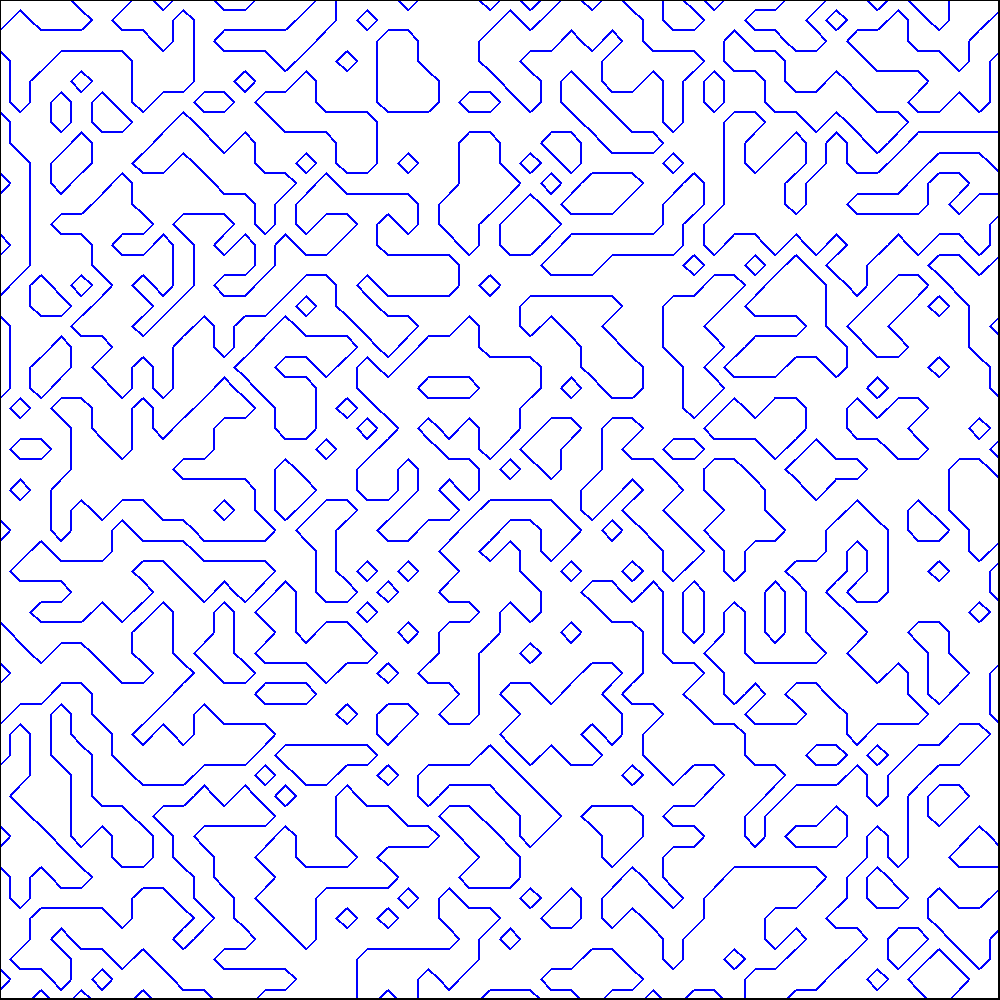

####MarchingSquares 等值线算法 java 初步实现
#####参考
https://en.wikipedia.org/wiki/Marching_squares  
https://d3js.org.cn/document/d3-contour/ 
https://openhome.cc/Gossip/P5JS/MarchingSquares.html  
https://openhome.cc/Gossip/P5JS/MarchingSquares2.html  
https://openhome.cc/Gossip/P5JS/MarchingSquares3.html  

####输出效果

